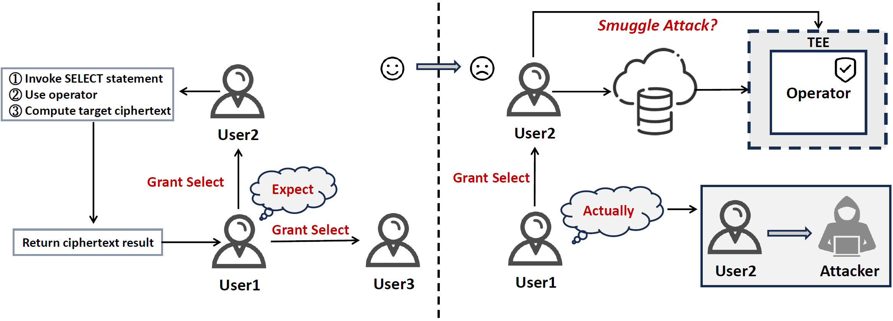

<p align="center">
	
</p>


# From Protector to Predator


## Preparation: Install StealthDB

To view the experiment results in more detail, you need to install [StealthDB](https://github.com/cryptograph/stealthdb) on Ubuntu. StealthDB installation requires the following preparations:

- Intel SGX

  - The [SGX PSW and SDK](https://github.com/01org/linux-sgx#build-the-intelr-sgx-sdk-and-intelr-sgx-psw-package) installed in the `/opt` directory
  - Version 2.0 of the [SGX Driver](https://github.com/01org/linux-sgx-driver#build-and-install-the-intelr-sgx-driver)

- The NASM assembler。 You can follow these steps:

  ```bash
  sudo apt update
  sudo apt install nasm
  ```

  After installing the above dependencies, you can start the actual installation of StealthDB. For the detailed steps, see [here](https://github.com/cryptograph/stealthdb)😎😎

## Dataset

We have two data sources. One is the [Diabetes Health Indicators Dataset](https://www.kaggle.com/datasets/alexteboul/diabetes-health-indicators-dataset) from 2015, a health-related telephone survey collected annually by the CDC. The other is our synthetic data table `fruit`.

- The former can be downloaded from Kaggle, or you can find it in the `data` directory. You need to import it into StealthDB. Converting it into SQL insert statements might fail frequently, so it’s recommended to use the more reliable `copy` operation. We provide relevant scripts in `/Interface/ILA/ILA/load.py`. You can execute it directly:

  ```bash
  sudo apt update
  sudo apt install python3-dev libpq-dev
  ```

  ```
  python3 load.py
  ```

- The latter can be found in the SQL files in the `data` directory. You need to execute them and import them into StealthDB.

## Quickstart

### Preparations

You need PostgreSQL version 10.23, Python 3.6, and the following dependencies:

```sudo
pip3 install pandas
pip3 install numpy
pip3 install psycopg2
pip3 install scipy
pip3 install scikit-learn
```

### Malicious Monitor

You can use the bash script in `/Interface/Monitor/bash script` and execute the following:

```bash
chmod +x monitor.sh
```

```bash
./monitor.sh
```

You will be able to monitor activities similar to:

```
23090, |, john, | select  * from fruit where quantity=pg_enc_int4_encrypt(2); | active
```

You can also use the Python script in `/Interface/Monitor/python script` and execute:

```
python3 monitor.py
```

Both methods will generate monitoring logs in the corresponding directory.

### Index Leakage 

First, the DBA needs to use monitoring to check if a user has executed an SQL query. If so, they should immediately observe changes in index metrics and estimate the approximate result set size by combining system tables and views. We provide a Python script for this operation, located in `/Interface/ILA/monitor`, which you can execute to generate the results:

```
python ILA_monitor.py
```

In `/Interface/ILA/ILA`, we provide relevant attack test scripts, including auxiliary dataset generation scripts, two types of attack scripts (exact matching), range matching scripts, and evaluation scripts.

- You can specify the target columns and sampling ratios. The sampled data will be removed from the original dataset:

  ```
  python Preprocessing.py
  ```

- You can view the results of two attack methods. For the $L_p$-Optimization matching Attack, you need to set the parameter `p`:

  ```
  python Hist_Attack.py
  ```

  ```
  python Lp_Optimization.py
  ```

- You can perform range matching and evaluate it:

  ```
  python Kmeans_Lp.py
  ```

  ```
  python CH_Index.py
  ```

### Statistic Information Leakage

For statistic information leakage, we have created parsing scripts to explicitly present the leaked information. These scripts are located in `/Interface/Statistic Information`.

- First, execute the following script to generate a CSV table:

  ```
  python export.py
  ```

- Then, execute the following script, which will process the table and explicitly present the leakage results:

  ```
  python process.py
  ```

- Alternatively, you can execute the following script, which will directly output the leakage results:

  ```
  python statistic.py
  ```

- You will observe results like the following, where key leakage information has been explicitly presented and summarized:

  ```
  attr1:
      ——stanullfrac=0.0
      —— Unique value rate: Estimated: 100.00% of total rows
      —— Unique value count: 12.0
      —— stakind=2
          —— Histogram bounds: {1,2,3,4,5,6,7,8,9,10,11,12}
  attr2:
      ——stanullfrac=0.0
      —— Unique value rate: Estimated: 100.00% of total rows
      —— Unique value count: 12.0
      —— stakind=2
          —— Histogram bounds: {Apple,Banana,Cherry,Grape,Kiwi,Mango,Orange,Peach,Pear,Pineapple,Strawberry,Watermelon}
  attr3:
      ——stanullfrac=0.0
      —— Unique value rate: Estimated: 75.00% of total rows
      —— Unique value count: 9.0
      —— stakind1=1
          —— Most common values: {l9g9v9VzlLQfKfkizLwmq2XVjjy8OZvRHBPRRYOSpsX=,ocDlW2uMcmFtZYCLs4YuJ+qI6BfW8PfyaVzx2T0aFmb=}
          —— Frequencies: [0.25, 0.166667]
      —— stakind=2
          —— Histogram bounds: {l9g9v9VzlLQfKfkizLwmq2XVjjy8OZvRHBPRRYOSpsX=,ocDlW2uMcmFtZYCLs4YuJ+qI6BfW8PfyaVzx2T0aFmb=}
  ```


### Grant Misuse

You can perform authorization in StealthDB. If an authorized party is granted `SELECT` permission, they can perform a smuggle attack without needing to invoke encryption functions (without the key).



### Log Leakage

In the default configuration of StealthDB, certain erroneous SQL statements are logged. The MDBA can collect these erroneous statements over time to extract the plaintext data. Common errors include:

- **Syntax Errors**: For example, writing `melect` instead of `select`.
- **Data Type Errors**: For example, comparing text and numbers.
- **Calculation Errors**: For example, `quantity=2/0`.
- **Reference Errors**: For example, referencing a non-existent table.
- **Permission Errors**: For example, connecting to the database but lacking `SELECT` permission, yet attempting to execute `SELECT`.
- …………

## Acknowledgements

- We would like to express our sincere gratitude to [StealthDB](https://github.com/cryptograph/stealthdb) for providing a powerful platform that significantly aided our research and experiments.
- [Smuggle Attack]([Encrypted Databases Made Secure Yet Maintainable | USENIX](https://www.usenix.org/conference/osdi23/presentation/li-mingyu)) provides  theoretical support for some of our  findings.

